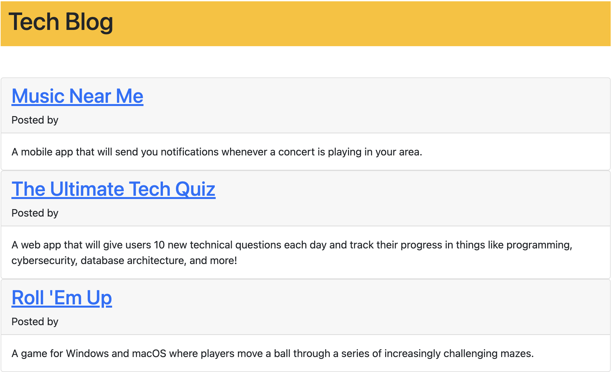

# MVC Tech Blog

## About

This is an MVC-style tech blog, intended for sharing information and thoughts about new and current technology. Users can publish articles and leave comments on the articles of others. 

## Development

This app uses Express-session to save user details, Sequelize to run the database, and Handlebars.js as the templating engine.  

## How to Use

Save the code using `git clone`

Install dependencies using `npm i`

Seed the database with `npm run seed`

Then start the application by running `npm run start`

The application is also [deployed to Heroku](https://secret-taiga-67264.herokuapp.com/)
